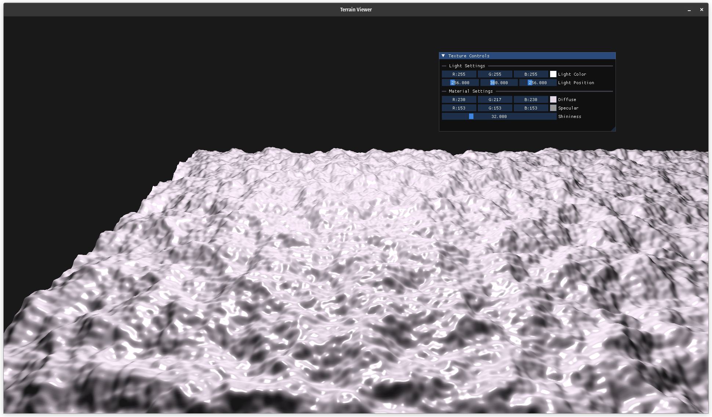
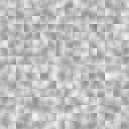
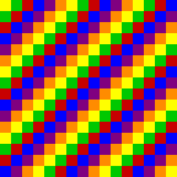

# Rule-based Procedural Terrain Generation (Proof of Concept)

## Motivation

Most FPS games today rely on hand-crafted maps: predictable, static, and prone to memorization. But what if maps could evolve? This project explores rule-based procedural terrain generation, where strategic zones (arenas, chokes, flanks) are assembled intelligently using noise and spatial rules. The goal: maps that are both fresh and tactically rich, without sacrificing gameplay balance.

## Demo

## GUI Preview

An early OpenGL-based GUI has been added for real-time visualization.

### Implemented:
- Middle-click + drag to pan the terrain
- Scroll to zoom (camera moves forward/back)
- 3D rendering of terrain mesh with basic lighting
- Color-coded strategic zones (arena, flank, choke, etc.)



> Useful for inspecting terrain structure and zone placement dynamically. More interactivity (like ImGui tweaking and wireframe mode) is planned.


[Here is a video link to a short demo.](https://github.com/user-attachments/assets/8b229098-9080-4e5a-a67f-495d3f0bd58c)

## CLI interface


A montage of generated terrains with overlay labels defining each zone. For various frequencies using `BasicStrategy`
| Zone Type     | Color  | Description                                                 |
| ------------- | ------ | ----------------------------------------------------------- |
| `ARENA`       | Green 🟩    | Balanced open combat area - ideal for primary engagements.  |
| `CHOKE`       | Red   🟥    | Tight, narrow paths forcing close combat.                   |
| `FLANK`       | Blue  🟦    | Side routes for surprise attacks and sneaky plays.          |
| `HIGH_GROUND` | Purple 🟪    | Elevated terrain giving visibility and cover advantage.     |
| `SPAWN`       | Yellow 🟨    | Player spawn zones, usually at corners or safe zones.       |
| `OBJECTIVE`   | Orange 🟧    | Central map goals: capture points, bombs, etc.              |
| `UNASSIGNED`  | Gray   ⬜     | Default/fallback tile - not assigned to any strategic role. |

Here are some more zone distribution maps generated from another Strategy:


## Current Features

A prototype for rule-based procedural terrain generation aimed at FPS or tactical game map design. This project uses Perlin noise and custom heuristics to create terrain-aware strategic zones like arenas, flanks, and chokepoints.

Current features include:

* ✅ **Global heightmap generation** using Perlin noise
* ✅ **Rule-based zone assignment** based on terrain stats (e.g., elevation, position)
* ✅ **2D visualizations** of terrain (`terrain_map.png`), zone layout (`zone_map.png`), and combined overlay (`overlay_map.png`)
* ✅ **Modular architecture**: clearly separated components (`Tile`, `Zone`, `TileMap`, `ZonePlanner`)
* ✅ **Customizable zone heuristics** via strategy lambdas
* ✅ **Exportable debug artifacts** for map tuning and comparison
> * OpenGL real-time terrain rendering
> * Interactive camera or gameplay loop


## Goals
A real-time terrain generation demo using C++ and OpenGL.
This project visualizes large-scale, procedurally generated landscapes using Perlin noise and fractal algorithms. Features include:

 - Heightmap-based terrain mesh generation
 - Real-time rendering with OpenGL (GLFW + GLAD)
 - Basic camera movement (WASD + mouse)
 - Optional wireframe/debug modes
 - Designed for performance and scalability

## Architecture Overview

### 1. Tile

- Represents the smallest unit on the map. like a single square in a grid.
- Properties:
  - `zone_type`: What kind of area it belongs to.
  - `height`: elevation (from noise).
  - `has_cover`: whether it has strategic cover(derived from the elevation).

### 2. Zone

- Represents a higher level area. A contiguous group of tiles that share the same zone type. A zone represents a strategic role on the map.
- They allow for strategic gameplay by grouping tiles into meaningful areas, enabling players to plan and execute tactics based on terrain features.
- Reponsibilities:
	- Defines spatial bounds (x_start, y_start, size)
	- Generates terrain within its bounds using Perlin noise (or similar)
	- Modifies tile features based on zone logic
- Types:
	- ARENA: Open combat zones.
	- CHOKE: Narrow passages or tactical bottlenecks.
	- FLANK: Peripheral paths for side attacks.
> ### Why zones? 
> They let us apply rule based procedural generation, where each zone behaves differently based on its type leading to gameplay aware layouts instead of generic noise blobs.

### 3. TileMap

- Represents the entire map as a grid of `Tile`s.
- Responsibilities:
	- Helper functions to access tiles by coordinates.
	- Utility methods and export functionality.

### 4. ZonePlanner
- The game director that decides where to place zones and what type they should be.
- Instead of placing zones randomly, it uses rule based logic to assign:
	- Zone positions - where on a map they begin
	- Zone types - what kind of zone they are (e.g. arena, choke, flank)
- Decisions are based on:
	- Tile height (elevation)
	- Proximity to other zones (strategic placement. e.g. flanks near arenas or avoiding multiple chokepoints in a row)
  	- Strategic considerations (e.g. flanks near map edges and arenas near the center)

### How pieces fit together:
The terrain generation process begins with the `ZonePlanner`, which analyzes the map space and assigns different zone types based on strategic rules. Each `Zone` then procedurally generates terrain within its bounds, using Perlin noise to create variation in height and cover. These changes are applied to individual `Tile` instances stored in the `TileMap`, which acts as the central source of truth for the entire terrain grid.

This modular, layered design allows for both flexible rule enforcement (via zones) and continuous terrain realism (via noise). The result is a procedurally generated map that looks natural, but plays with intent: ideal for first-person shooters and tactical games where spatial dynamics matter.


## Initial Prototype - 2D Noise Visualization v0.1

The first proof-of-concept focuses on generating a 2D grid-based map using Perlin noise and rule-driven zone assignment. Each map is composed of small Tiles, grouped into strategically meaningful Zones (e.g. ARENA, CHOKE, FLANK).

**Outputs**
- terrain_map.png: Grayscale heightmap showing elevation using Perlin noise.
- zone_map.png: Color-coded zone map showing tactical layout and zone roles.

**Terrain Heightmap**



**Zone Layout**



> ### Note: 
> - This version only creates noise for the elevation map. Terrain smoothening has not been implemented yet.
> - The Zone generation rules is not implemented yet.

This prototype demonstrates the foundation of a rule-based procedural generation engine - where terrain is shaped not just randomly, but intentionally, to support interesting gameplay scenarios.


## Upgraded Prototype - 2D Terrain Map v0.2

Here is what we have been doing till now:

```cpp
// Init TileMap and ZonePlanner
TileMap tileMap(MAP_WIDTH, MAP_HEIGHT);
ZonePlanner planner(MAP_WIDTH, MAP_HEIGHT, ZONE_SIZE);

// Generate the zone layout
auto zones = planner.planZones();

// Generate terrain for each zone
for (auto& zone : zones) {
	zone.generate(tileMap);
}
```

The terrain elevation was generated within each zone independently. While this worked for local variation, it led to discontinuities at zone boundaries, resulting in an unnatural, fragmented look.

## What is new?

Terrain generation and zone planning have been decoupled for better control and realism. Instead of generating terrain separately inside each zone, we now produce a global heightmap first using Perlin noise. This ensures smooth, continuous elevation across the entire map.

Once the terrain is in place, zones are assigned on top of the terrain using rule-based heuristics. These heuristics take into account elevation patterns and spatial location to assign appropriate zone types (e.g., choke, flank, high ground, arena).

```cpp
    // Define a strategy
    auto basicStrategy = [&](float avg, float stddev, int x, int y) -> ZoneType {
        if (avg > 0.6f) return ZoneType::HIGH_GROUND;
        if (avg < -0.4f) return ZoneType::CHOKE;
        if ((x < MAP_WIDTH / 4 || x > 3 * MAP_WIDTH / 4) ||
            (y < MAP_HEIGHT / 4 || y > 3 * MAP_HEIGHT / 4)) return ZoneType::FLANK;
        return ZoneType::ARENA;
    };

	// Initialize the tile map with specified dimensions
    TileMap tileMap(MAP_WIDTH, MAP_HEIGHT);

	// Generate random terrain for the tile map
    tileMap.generateGlobalHeightMap();

	// Plan the zones based on the generated terrain and strategy
    ZonePlanner planner(MAP_WIDTH, MAP_HEIGHT, ZONE_SIZE);
    auto zones = planner.planZones(tileMap, basicStrategy);

    // TileMap applies the zone
    tileMap.applyZones(zones);
```

This change preserves the strengths of rule-based zone placement while grounding it in a realistic, seamless terrain foundation essential for gameplay immersion and navigability.

